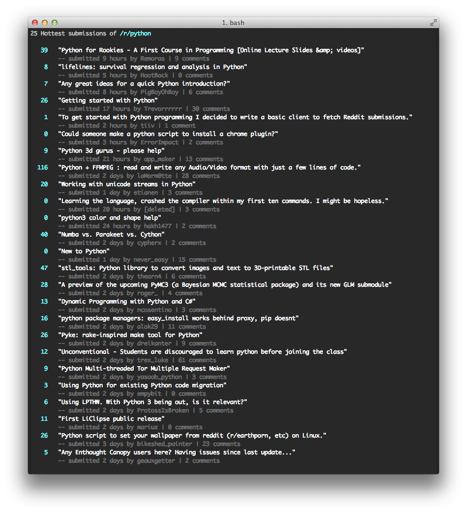

alien
=====
Python command line tool for displaying submissions of a particular subreddit


## Setup


Requires a working python installation.

Put the script in one of the system folders for easy invocation, e.g.:

 - /usr/bin
 - /usr/local/bin
 
and make it executable by invoking
 
```bash
chmod +x alien.py
```

To view submissions of a particular subreddit (e.g. /r/python), simply invoke:

```bash
alien.py python
```


## TODO

 - Maybe find a better name
 - Correct submission timestamps (there seem to be deviations in comparison to the website)
 - Display content of text only submissions?? 


## Screenshots


